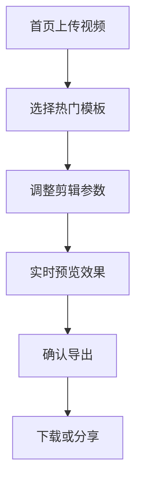

## 1. Product Overview
一款专门用于一键剪辑抖音热门短剧的移动端Web应用，帮助用户快速创建高质量的短视频内容。
- 解决传统视频剪辑复杂、耗时的问题，提供一键式解决方案
- 目标用户为抖音创作者、内容营销人员及短视频爱好者

## 2. Core Features

### 2.1 User Roles
| Role | Registration Method | Core Permissions |
|------|---------------------|------------------|
| 普通用户 | 无需注册 | 使用所有基础剪辑功能，导出视频 |

### 2.2 Feature Module
1. **首页**: 视频上传、热门模板推荐、一键剪辑入口
2. **剪辑页面**: 模板选择、参数调整、实时预览
3. **导出页面**: 视频导出、下载分享

### 2.3 Page Details
| Page Name | Module Name | Feature description |
|-----------|-------------|---------------------|
| 首页 | 视频上传区域 | 支持拖拽或点击上传视频文件 |
| 首页 | 热门模板推荐 | 展示精选的抖音热门短剧模板 |
| 剪辑页面 | 模板选择 | 提供多种短剧剪辑模板供用户选择 |
| 剪辑页面 | 参数调整 | 调整视频时长、转场效果、背景音乐等参数 |
| 剪辑页面 | 实时预览 | 实时预览剪辑效果 |
| 导出页面 | 视频导出 | 一键导出剪辑好的视频 |
| 导出页面 | 分享功能 | 支持分享到抖音等平台 |

## 3. Core Process
用户在首页上传视频 → 选择合适的热门短剧模板 → 调整参数并预览 → 一键导出并分享

## 4. User Interface Design
### 4.1 Design Style
- 主色调：抖音红 (#FF0050) + 黑色 (#000000)
- 辅助色：白色 (#FFFFFF) + 灰色 (#666666)
- 按钮风格：圆角按钮，渐变效果，点击有缩放动画
- 字体：使用现代无衬线字体，清晰易读
- 布局风格：卡片式布局，大按钮设计，适合移动端操作
- 图标风格：简洁、扁平化的SVG图标

### 4.2 Page Design Overview
| Page Name | Module Name | UI Elements |
|-----------|-------------|-------------|
| 首页 | 上传区域 | 大型上传按钮，拖拽区域，带有动态边框效果 |
| 首页 | 模板推荐 | 网格布局展示模板卡片，卡片有悬停效果 |
| 剪辑页面 | 参数面板 | 滑动条、下拉选择器，实时更新预览 |
| 剪辑页面 | 预览窗口 | 居中展示视频预览，带有控制按钮 |
| 导出页面 | 进度条 | 动态进度条显示导出进度 |

### 4.3 Responsiveness
- 移动优先设计，适配iOS和Android主流手机屏幕
- 触控优化：大按钮、足够的触控间距
- 响应式布局：支持横屏和竖屏切换

### 4.4 3D Scene Guidance
不适用3D场景
